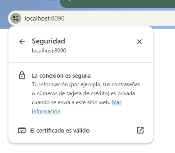

# Certificados para localhost

Este archivo contiene las instrucciones para generar tu propio certificado autofirmado de localhost que se utilizará en la instalación del agente.
Para generar los archivos necesarios, debes disponer de una terminal y **OpenSSL** instalado. Los archivos de ejemplo de este manual se han generado con **OpenSSL 3.2.0**.

## Generar certificado root

Se debe primero generar un certificado root, que es el que se utilizará para firmar el resto de archivos que vamos a utilizar. Para ello debes ejecutar los siguientes comandos en tu terminal:

``` bash
#!/bin/bash
openssl genrsa -des3 -out rootCA.key 2048
openssl req -x509 -new -nodes -key rootCA.key -sha256 -days 7300 -out rootCA.pem
```

Esto generará 2 archivos: **rootCA.key** y **rootCA.pem**

Se debe definir una clave y la información adicional que solicita para crear el certificado el certificado.

Es importante definir correctamente el CN del certificado, para este caso localhost.

Ejemplo de ejecución del comando:

``` bash
openssl req -x509 -new -nodes -key rootCA.key -sha256 -days 7300 -out rootCA.pem
Enter pass phrase for rootCA.key:
You are about to be asked to enter information that will be incorporated
into your certificate request.
What you are about to enter is what is called a Distinguished Name or a DN.
There are quite a few fields but you can leave some blank
For some fields there will be a default value,
If you enter '.', the field will be left blank.
-----
Country Name (2 letter code) [AU]:CL
State or Province Name (full name) [Some-State]:State
Locality Name (eg, city) []:City
Organization Name (eg, company) [Internet Widgits Pty Ltd]:Continuum
Organizational Unit Name (eg, section) []:TransbankDevelopers
Common Name (e.g. server FQDN or YOUR name) []:localhost
Email Address []:transbankdevelopers@continuum.cl
```

## Agregar el certificado a la lista de confianza

Se debe agregar el certificado generado a la lista de confianza del equipo donde se vaya a utilizar.
Por ejemplo, para Windows y Chrome se puede realizar de la siguiente manera:

Ir a configuración del navegador -> privacidad y seguridad -> seguridad -> gestionar los certificados del dispositivo -> entidades de certificación raíz de confianza.

Desde ahí debes importar el certificado que creaste anteriormente (**rootCA.pem**).

Luego de importarlo, podrás verificar que existe en tu lista de certificados uno nuevo emitido por *localhost*.

## Crear certificado de dominio

Para crear nuestro certificado de dominio, utilizaremos 2 archivos de configuración que podremos modificar con cualquier editor de texto.

Crearemos primero un archivo llamado *server.csr.inf*, que deberá tener la siguiente estructura:

```
[req]
default_bits = 2048
prompt = no
default_md = sha256
distinguished_name = dn

[dn]
C=CL
ST=Santiago
L=Santiago
O=Organization
OU=OrganizationUnit
emailAddress=transbankdevelopers@continuumhq.com
CN = localhost
```

Personalizamos la sección *dn* con la información que utilizamos para la creación del primer certificado.

El segundo archivo a generar se llamará **v3.ext**.

Debe contener esta información:

```
authorityKeyIdentifier=keyid,issuer
basicConstraints=CA:FALSE
keyUsage = digitalSignature, nonRepudiation, keyEncipherment, dataEncipherment
subjectAltName = @alt_names

[alt_names]
DNS.1 = localhost
```

Ahora podemos ejecutar estos comandos para crear el certificado de dominio para localhost.

```bash
#!/bin/bash
openssl req -new -sha256 -nodes -out server.csr -newkey rsa:2048 -keyout localhost.key -config server.csr.cnf
openssl x509 -req -in server.csr -CA rootCA.pem -CAkey rootCA.key -CAcreateserial -out localhost.crt -days 825 -sha256 -extfile v3.ext
```

Como resultado de ejecutar ambos comandos, se habrán generado los archivos **localhost.key** y **localhost.crt**.

## Instalar certificado
Luego de haber generado ambos certificados, se deben instalar para el funcionamiento del agente. Para esto deberás copiarlos a la carpeta 'resources/crt' de tu instalación del agente para POS.
Al iniciar el agente, si se han copiado correctamente se desplegará el siguiente mensaje:


Desde cualquier navegador podremos comprobar que el agente es reconocido como una conexión segura, accediendo al puerto que expone en el mensaje anterior a través de [https://localhost:8090](https://localhost:8090)



Si intentas iniciar el agente sin estos certificados obtendrás este error de ejecución:


